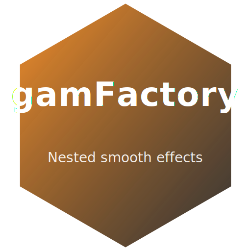

# SmoothForge

Welcome to **SmoothForge** 👋 — a collaborative GitHub organization for high-quality, open-source **R** tools focused on **smoothing**, **generalized additive models (GAMs)**, and modern statistical modeling.

Our goals:
- Build well-tested, well-documented packages for the R ecosystem.
- Share practical tooling for modeling, visualization, and workflows.
- Encourage collaboration through clear contribution guidelines and CI/CD.

---

## 📦 R Packages

> Quick install from GitHub (replace `REPO` with the package below):
>
> ```r
> # install.packages("remotes")
> remotes::install_github("SmoothForge/REPO")
> ```

### Package Gallery (Hex Icon Badges)

Each badge is an SVG hexagon; click any icon to open the repository.

<table>
  <tr>
    <td align="center" width="33%">
      <a href="https://github.com/SmoothForge/pymgcv">
        
      </a>
      <br/>
      <a href="https://github.com/SmoothForge/pymgcv"><b>pymgcv</b></a>
      <br/>
      <sub>Pythonic GAM utilities for R workflows</sub>
    </td>
    <td align="center" width="33%">
      <a href="https://github.com/mfasiolo/mgcViz">
        
      </a>
      <br/>
      <a href="https://github.com/mfasiolo/mgcViz"><b>mgcViz</b></a>
      <br/>
      <sub>GAM visualization tools</sub>
    </td>
    <td align="center" width="33%">
      <a href="https://github.com/mfasiolo/qgam">
        
      </a>
      <br/>
      <a href="https://github.com/mfasiolo/qgam"><b>qgam</b></a>
      <br/>
      <sub>Quantile GAMs</sub>
    </td>
  </tr>
  <tr>
    <td align="center" width="33%">
      <a href="https://github.com/mfasiolo/gamFactory">
        
      </a>
      <br/>
      <a href="https://github.com/mfasiolo/gamFactory"><b>gamFactory</b></a>
      <br/>
      <sub>Nested smooth effects</sub>
    </td>
    <td align="center" width="33%">
      <a href="https://github.com/eenticott/gamstackr">
        
      </a>
      <br/>
      <a href="https://github.com/eenticott/gamstackr"><b>gamstackr</b></a>
      <br/>
      <sub>Smooth model stacking</sub>
    </td>
    <td align="center" width="33%">
      <a href="https://github.com/VinGioia90/SCM">
        
      </a>
      <br/>
      <a href="https://github.com/VinGioia90/SCM"><b>SCM</b></a>
      <br/>
      <sub>Smooth covariance modelling</sub>
    </td>
  </tr>
</table>

---

## 🚀 Getting Started

1. **Browse the repos** above to see vignettes, examples, and documentation.
2. **Install from GitHub** using `remotes::install_github("OWNER/REPO")`.
3. **File issues** or start discussions for bugs, features, and ideas.

---

## 🤝 Contributing

We welcome contributions! Please:
- Open an issue to discuss major changes.
- Follow tidyverse-style naming and consistent linting.
- Include unit tests and minimal reproducible examples (reprex).
- Use conventional commit messages when possible.

---

## 📜 License

Each repository declares its own license. Unless otherwise noted, we default to permissive, OSI-approved licenses.

---

### Notes

- Icons are provided in `./assets/` as SVGs (hexagonal). You can change sizes directly in image tags without losing quality.
- If any package is moved under the `SmoothForge` org, update the install instructions accordingly.
