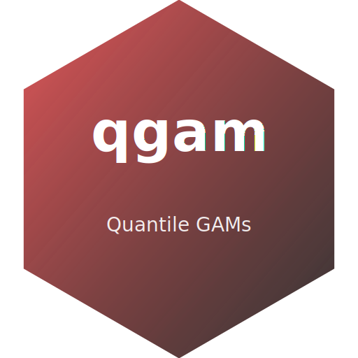
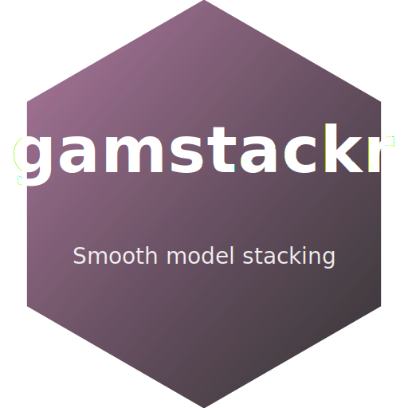

# SmoothForge

Welcome to **SmoothForge**: a collection of open-source **R** and **Python** tools focused on **smoothing** and **generalized additive modelling (GAM)**.

### Packages 📦

Click any icon to open the repository.

<div align="center">

<table role="presentation" cellspacing="0" cellpadding="0" style="border-collapse:collapse;border:none;margin:0 auto;">
  <tr>
    <td align="center" width="33%" style="border:none;padding:8px;">
      <a href="https://github.com/SmoothForge/pymgcv">
        
      </a>
      <br/>
      <a href="https://github.com/SmoothForge/pymgcv"><b>pymgcv</b></a>
      <br/>
      <sub>A Python interface to mgcv</sub>
    </td>
    <td align="center" width="33%" style="border:none;padding:8px;">
      <a href="https://github.com/mfasiolo/mgcViz">
        
      </a>
      <br/>
      <a href="https://github.com/mfasiolo/mgcViz"><b>mgcViz</b></a>
      <br/>
      <sub>GAM visualization tools</sub>
    </td>
    <td align="center" width="33%" style="border:none;padding:8px;">
      <a href="https://github.com/mfasiolo/qgam">
        
      </a>
      <br/>
      <a href="https://github.com/mfasiolo/qgam"><b>qgam</b></a>
      <br/>
      <sub>Quantile GAMs</sub>
    </td>
  </tr>
  <tr>
    <td align="center" width="33%" style="border:none;padding:8px;">
      <a href="https://github.com/mfasiolo/gamFactory">
        
      </a>
      <br/>
      <a href="https://github.com/mfasiolo/gamFactory"><b>gamFactory</b></a>
      <br/>
      <sub>Nested smooth effects</sub>
    </td>
    <td align="center" width="33%" style="border:none;padding:8px;">
      <a href="https://github.com/eenticott/gamstackr">
        
      </a>
      <br/>
      <a href="https://github.com/eenticott/gamstackr"><b>gamstackr</b></a>
      <br/>
      <sub>Smooth model stacking</sub>
    </td>
    <td align="center" width="33%" style="border:none;padding:8px;">
      <a href="https://github.com/VinGioia90/SCM">
        
      </a>
      <br/>
      <a href="https://github.com/VinGioia90/SCM"><b>SCM</b></a>
      <br/>
      <sub>Smooth covariance modelling</sub>
    </td>
  </tr>
</table>

</div>


To install any of the R packages above from GitHub do (replace `REPO` with the package of choice):
>
> ```r
> # install.packages("remotes")
> remotes::install_github("SmoothForge/REPO")
> ```
